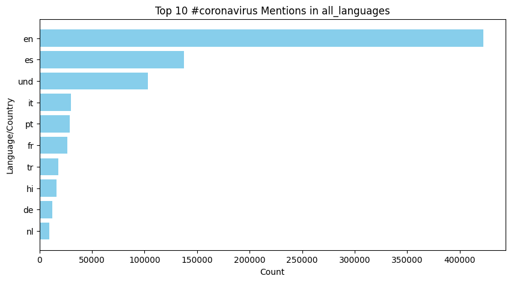
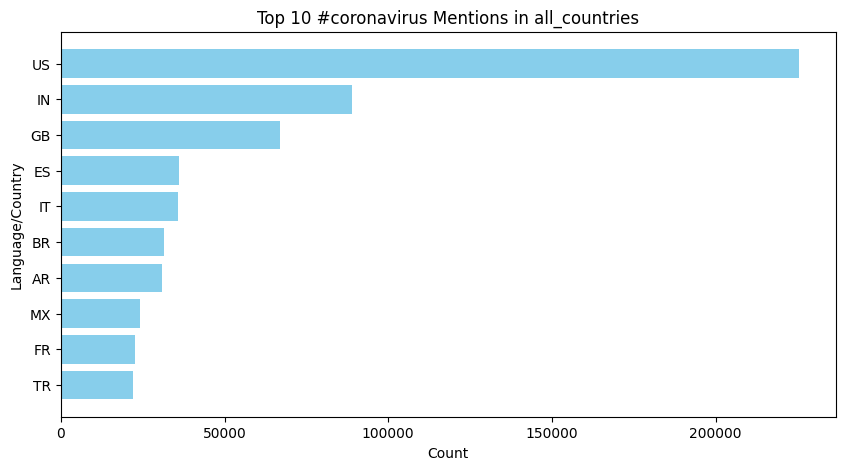

# README

## Tweet Hashtag Analysis Script

This project consists of multiple scripts designed to process Twitter data stored in ZIP archives, extract relevant information about COVID-19-related hashtags, and aggregate the results across multiple files.

### Features
- Extracts tweets from ZIP archives.
- Searches for predefined COVID-19-related hashtags.
- Counts hashtag occurrences by language and country.
- Outputs results as JSON files.
- Combines multiple language and country output files into consolidated files.
- Generates bar charts using `visualize.py` to visualize the top hashtags by language or country.

### Images
 For all languages, I saw this as the top 10 languages who mentioned #coronavirus in 2020. 
 

 For all languages, I saw this as the top 10 languages who mentioned #코로나바이러스 in 2020. 
 

 For all countries, I saw this as the top 10 countries who mentioned #coronavirus in 2020. 
 

 For all countries, I saw this as the top 10 countries who mentioned #코로나바이러스 in 2020. 
 
